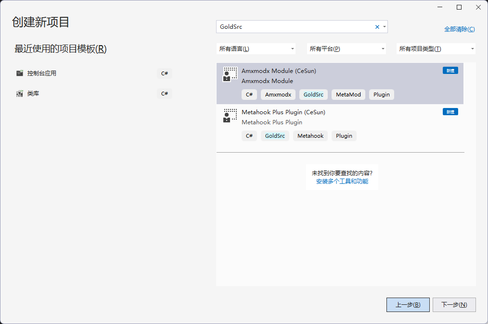

# GoldSrcMod.Net

无需虚拟机(coreclr或者mono)，借助.net9的nativeaot特性，使用c#为GoldSrc引擎游戏开发客户端(Metahook插件)或者服务端(Amxmodx模块)Mod

项目里各各SDK的命名以及使用方式尽量保持和c++原版一致，减少学习成本，所以代码中会有大量的“不安全(unsafe)”代码。

## 项目状态

***1. Metahook插件: 可用***

 ***2. AmxModX模块：可用***

## 平台支持：
仅限Windows，因为metahook只支持windows

## 开始上手：
### 准备环境
1. [可选] 安装visual studio 2022，并安装.net9工作负载
2. 如果不使用visual studio开发，可直接安装.net9 sdk: https://dotnet.microsoft.com/zh-cn/download/dotnet/9.0

### 创建项目：
1. 安装项目模板：
```shell
# metahook plugin项目模板
dotnet new install Metahook.Plugin.Template
# amxmodx module项目模板
dotnet new install Amxmodx.Module.Template
```
2. 创建项目

   2.1 打开VS，新建项目，搜索GoldSrc，如图列出Metahook Plugin和Amxmodx Module的项目模板

   
   
   2.2 或者执行命令行创建: 

      ```shell
      #  创建metahook plugin项目
      dotnet new MPT -o HelloMetahook
      
      #  创建amxmodx module项目
      dotnet new AMT -o HelloAmxmodx
      ```
   
### 编译
必须使用dotnet publish命令发布，或者使用ide的发布功能，选择[独立] [win-x86] 发布。

```shell
dotnet publish HelloMetahook.csproj -c Release -r win-x86 -o ./build
```

### 调试：

 请访问：[调试文档](Document/Debug.md)
